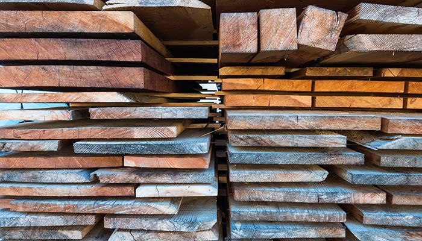
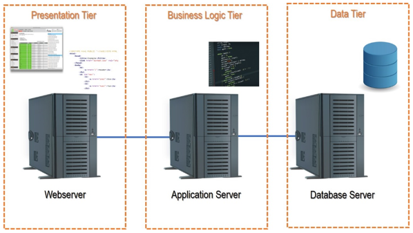
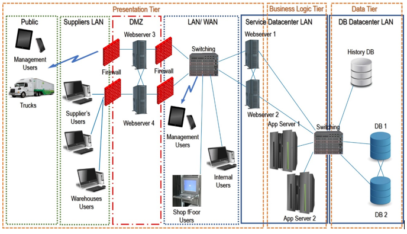
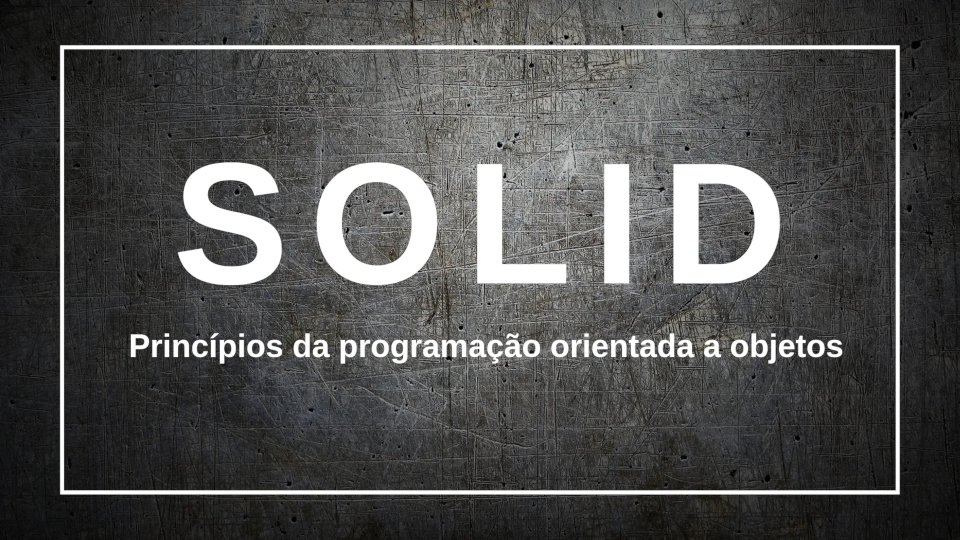

# CESAE ISI 5421 
 
## Work01
  
Conceitos utilizados em todas as aulas relacionadas com os conteúdos "**Work01**".  
  
## Polimorfismo:
O polimorfismo é frequentemente referido como o terceiro pilar da programação orientada para objectos, depois do encapsulamento e da herança. *O polimorfismo é uma palavra grega que significa "com muitas formas"*.  
Utilizados nos diversos componentes da solução em:  
  - Construtores;  
  - Métodos (mesmo comportamento, parâmetros diferentes, parâmetros opcionais);  
  
  
## Aplicação prática da arquitetura N-Tier:    
  
(fonte: https://s7280.pcdn.co/wp-content/uploads/2017/08/GettyImages-673113782.jpg.optimal.jpg)
  
**O que é a arquitetura de N camadas**?    
   
A arquitetura de N camadas (ou multi-camadas) refere-se a software que tem as suas várias camadas processadas por ambientes informáticos distintos (camadas) sob uma lógica cliente-servidor.  
  
A interface do utilizador (camada de apresentação) é executada num ambiente separado do "cálculo" (camada de lógica comercial) que, por sua vez, também é executado num ambiente distinto do motor e das instâncias da base de dados (camada de dados).  
    
Estes ambientes distintos (níveis) envolvem normalmente diferentes servidores, redes de centros de dados e, muitas vezes, regiões geográficas.  

Antes de prosseguir, é importante esclarecer a diferença entre "Nível" e "Camada". Uma camada é um componente lógico dentro de um conjunto de software que realiza uma determinada funcionalidade, enquanto que um nível é a plataforma lógica e de hardware onde essa camada é executada.  
  
Na maioria das vezes, faz sentido dividir os níveis acima mencionados para obter ainda mais flexibilidade, refinamento, segurança e eficiência da arquitetura.  
  
Ilustração **arquitetura 3-Tier**:    

(Exemplo 1)  
  
(fonte: https://s7280.pcdn.co/wp-content/uploads/2017/07/N-Tier_Architecture.png)  
  
(Exemplo 2)  
  
(fonte: https://upload.wikimedia.org/wikipedia/commons/thumb/5/51/Overview_of_a_three-tier_application_vectorVersion.svg/1186px-Overview_of_a_three-tier_application_vectorVersion.svg.png?20090531093531)  
  
(Exemplo 3)  
  
(fonte: https://s7280.pcdn.co/wp-content/uploads/2017/07/Presentation_Tier.png)  
  
(Exemplo 4)  
  
(fonte: https://learn.microsoft.com/en-us/azure/architecture/guide/architecture-styles/images/n-tier-logical.svg)  
  

## Princípios SOLID:
  
(fonte: https://miro.medium.com/v2/resize:fit:2000/format:webp/1*3VP8ciBC2w0NVV3JibPobw.png)

**S.O.L.I.D: Os 5 princípios da POO**
  - **S** — Single Responsiblity Principle (Princípio da responsabilidade única, uma classe deve ter um, e somente um, motivo para mudar)
  - **O** — Open-Closed Principle (Princípio Aberto-Fechado, objetos ou entidades devem estar abertos para extensão, mas fechados para modificação)
  - **L** — Liskov Substitution Principle (Princípio da substituição de Liskov, uma classe derivada deve ser substituível pela sua classe base)
  - **I** — Interface Segregation Principle (Princípio da Segregação da Interface, uma classe não deve ser forçada a implementar interfaces e métodos que não irão utilizar)
  - **D** — Dependency Inversion Principle (Princípio da inversão da dependência, dependa de abstrações e não de implementações)

**Leitura recomendada** deste [artigo](https://medium.com/desenvolvendo-com-paixao/o-que-%C3%A9-solid-o-guia-completo-para-voc%C3%AA-entender-os-5-princ%C3%ADpios-da-poo-2b937b3fc530) na plataforma Medium.
  
  